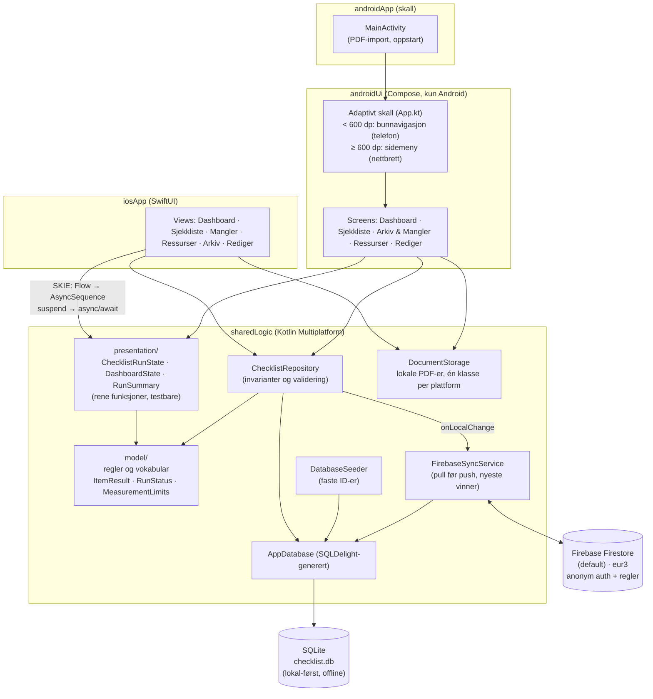

# Arkitektur

## Notater

- **Lokal-først**: alt UI leser/skriver kun mot SQLite via repositoryet. Firestore er
  et synkroniseringslag, aldri en forutsetning – appen fungerer fullt ut uten dekning.
- **UI deles ikke, men tilstanden gjør det**: SwiftUI på iOS (hovedplattform),
  Compose på Android. Det skjermene *viser* – fasedeling, tellere, om noe kan
  signeres, avviksteksten i arkivet – utledes i `presentation/` og leses likt av
  begge. Tidligere lå den utledningen i view-koden på hver plattform, i to
  kopier som hadde begynt å skli fra hverandre; iOS-dashbordet viste for
  eksempel «Ikke påbegynt» uansett tilstand. Laget er rene funksjoner uten SQL,
  Firebase eller UI-rammeverk, og dekkes derfor av de vanlige host-testene.
- **Én Android-app for både telefon og nettbrett**: `App.kt` måler tilgjengelig bredde
  med `BoxWithConstraints` og eksponerer `LocalIsCompact`. Under 600 dp brukes
  bunnavigasjon og én-kolonne layout (som iOS-appen), over 600 dp sidemeny og
  fler-kolonne. Skjermene er de samme – kun plasseringen endres.
- **Repositoryet utløser synken**, ikke skjermene: skriveoperasjoner som endrer
  noe delbart varsler selv. Utløseren lå tidligere som en callback tredd gjennom
  UI-treet, og to skjermer på Android fikk den aldri. Svar på enkeltpunkter er
  bevisst unntatt – de sendes samlet ved signering.
- **Synk er isolert i én klasse.** Resten av appen kaller `requestSync()` og leser
  `status`; ingen andre kjenner Firestore. Skal backend byttes med et internt Røde
  Kors-API, er `FirebaseSyncService` den ene klassen som skrives om. Merk at
  `sharedLogic` fortsatt avhenger av Firebase-bibliotekene direkte – et bytte er
  en reell jobb, ikke et konfigurasjonsvalg.
