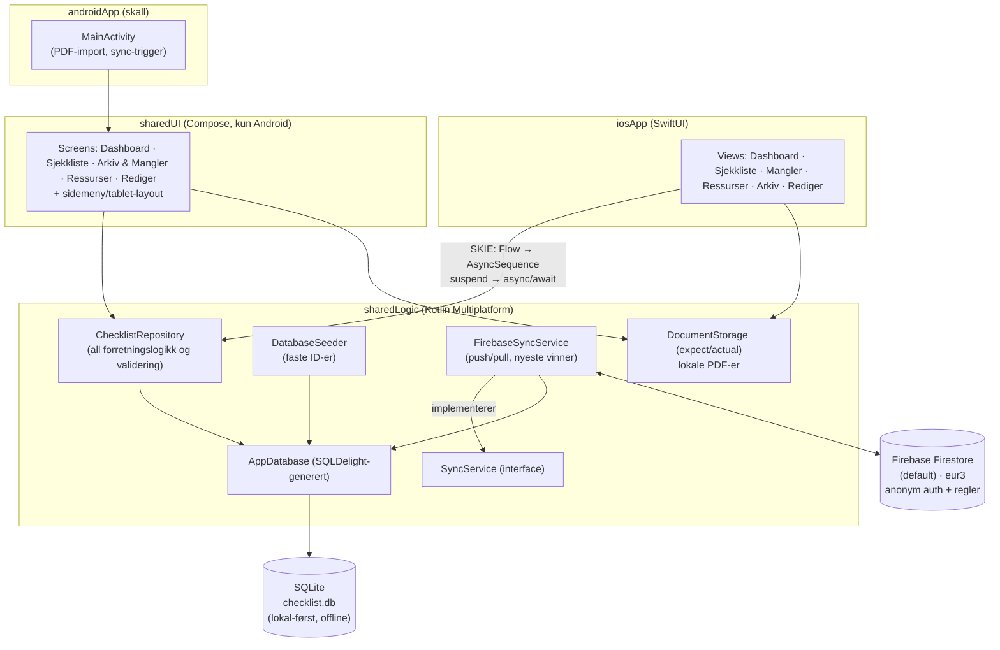

# Arkitektur

## Notater

- **Lokal-først**: alt UI leser/skriver kun mot SQLite via repositoryet. Firestore er
  et synkroniseringslag, aldri en forutsetning – appen fungerer fullt ut uten dekning.
- **UI deles ikke**: SwiftUI på iOS (hovedplattform), Compose på Android-nettbrett.
  All logikk, validering og datamodell deles i sharedLogic.
- **SyncService-kontrakten** gjør Firebase utbyttbar med et internt Røde Kors-API
  uten endringer i app-lagene.
