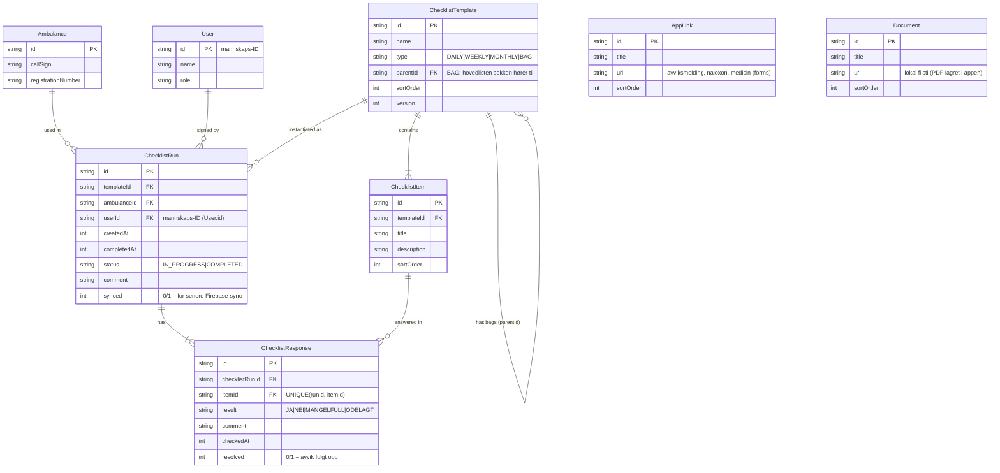

# Database ER Diagram

## Notater

- **Sekker/tasker**: egne `ChecklistTemplate` med `type = BAG` og `parentId` til hovedlisten.
  En kjøring av daglig liste dekker også sekkenes punkter
- **Mangler**: `getOpenDeficiencies` henter alle responses med resultat NEI/MANGELFULL/ODELAGT
  som ikke er `resolved` – vises på egen oversiktsside.
- **Document.uri**: peker på PDF lagret lokalt via `DocumentStorage`
- **User**: opprettes med mannskaps-ID som id (`addUser`), brukes ved signering.
