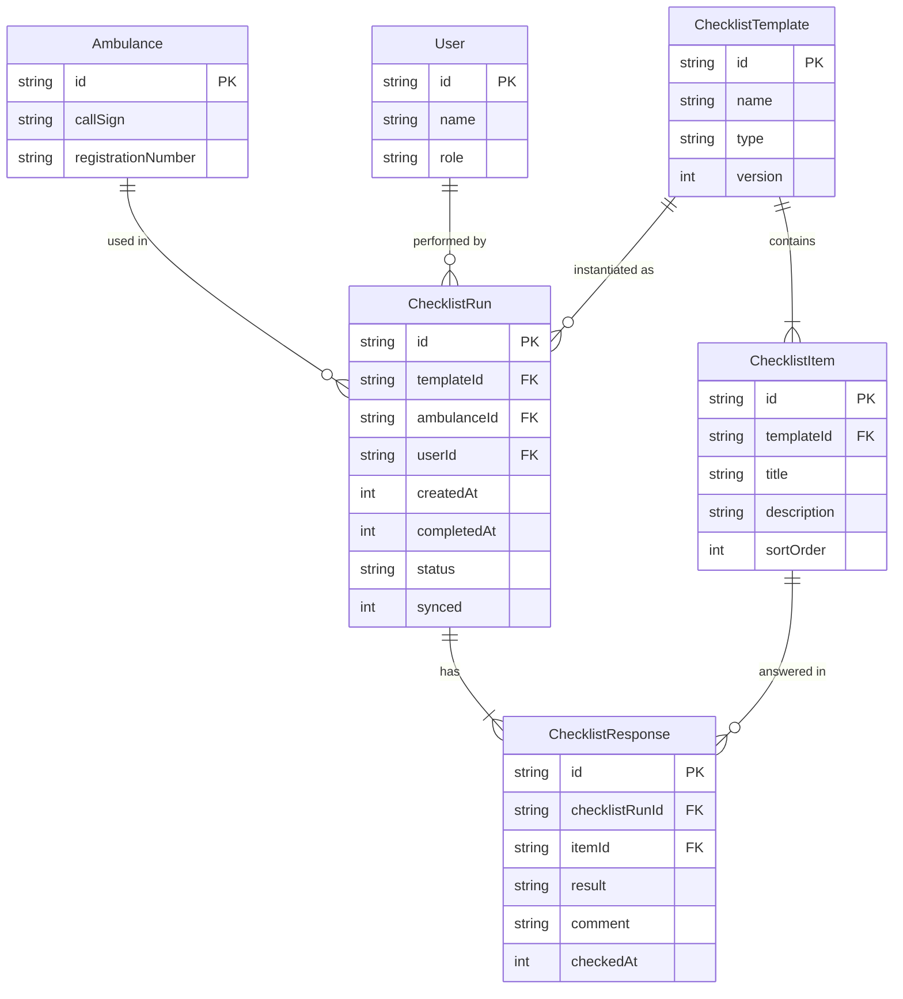

# Database ER Diagram

```mermaid
erDiagram
    Ambulance ||--o{ ChecklistRun : "used in"
    User ||--o{ ChecklistRun : "performed by"
    ChecklistTemplate ||--|{ ChecklistItem : "contains"
    ChecklistTemplate ||--o{ ChecklistRun : "instantiated as"
    ChecklistRun ||--|{ ChecklistResponse : "has"
    ChecklistItem ||--o{ ChecklistResponse : "answered in"

    Ambulance {
        string id PK
        string callSign
        string registrationNumber
    }

    User {
        string id PK
        string name
        string role
    }

    ChecklistTemplate {
        string id PK
        string name
        string type
        int version
    }

    ChecklistItem {
        string id PK
        string templateId FK
        string title
        string description
        int sortOrder
    }

    ChecklistRun {
        string id PK
        string templateId FK
        string ambulanceId FK
        string userId FK
        int createdAt
        int completedAt
        string status
        int synced
    }

    ChecklistResponse {
        string id PK
        string checklistRunId FK
        string itemId FK
        string result
        string comment
        int checkedAt
    }
```
