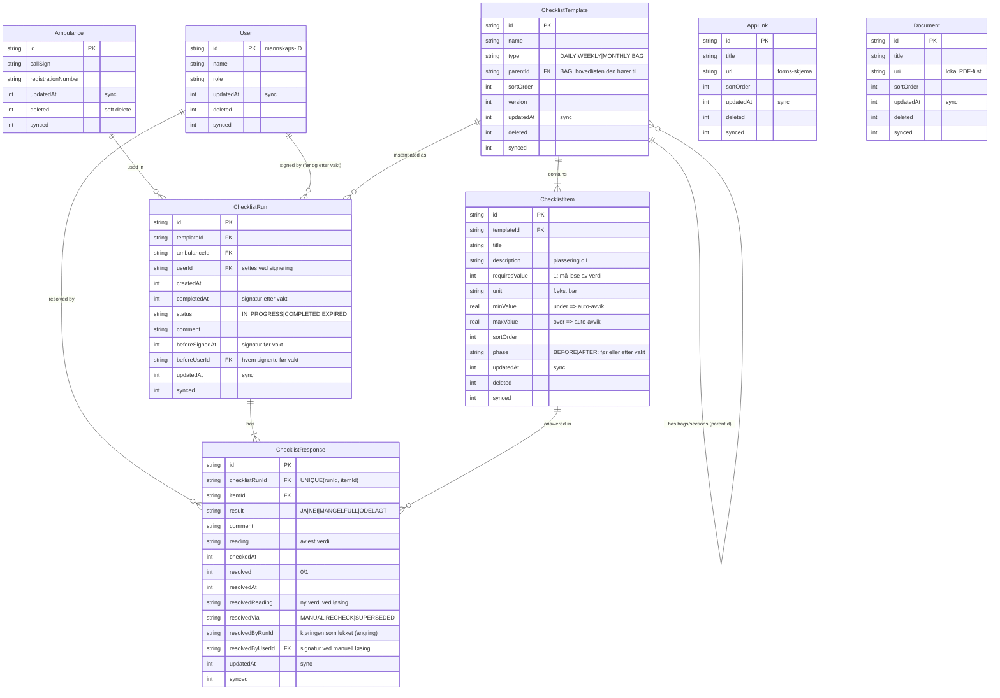

# Database ER Diagram

## Notater

- **Sekker/seksjoner**: `ChecklistTemplate` med `type = BAG` og `parentId` til hovedlisten.
  Brukes både for fysiske tasker (Akuttkoffert) og bilens seksjoner (Førerkupe, Sidedør …).
  Én kjøring av hovedlisten dekker alle punkter, også i sekkene.
- **To faser**: hvert punkt er merket `BEFORE` eller `AFTER`. Avslutningspunktene
  (oksygen skrudd av, vask, km notert) lå tidligere blandet inn i før-lista, og
  mannskapet trodde de måtte begynne på nytt etter vakta.
- **To signaturer**: `beforeSignedAt`/`beforeUserId` for før-kontrollen,
  `completedAt`/`userId` for avslutningen. Kjøringen står som `IN_PROGRESS` helt til
  begge er satt – en påbegynt vakt skal være synlig. Statuskolonnen fikk bevisst ingen
  ny verdi: det ville krevd `CHECK`-endring, altså tabellombygging på enheter i drift.
  `signBeforeShift` validerer bare før-punktene; `completeRun` krever begge deler, men
  bare for lister som faktisk har etter-punkter (ukentlig og månedlig signeres én gang).
  Før-delen kan gjenåpnes til vakta avsluttes; etter det er alt låst.
- **Utløp**: en kontroll som har stått åpen lenger enn 16 timer regnes som forlatt og
  merkes `EXPIRED` (bevares i arkivet hvis noe er besvart, slettes hvis den er tom).
  Grensa er en varighet og ikke et døgnskille, fordi nattevakter krysser midnatt.
  Neste vakt kan alltid starte en ny kontroll selv om forrige aldri ble avsluttet –
  en glemt avslutning skal ikke sperre kontrollen av bilen.
- **Målepunkter**: `requiresValue`/`unit`/`minValue`/`maxValue`. Avlest verdi lagres i
  `reading`; verdier utenfor grensene flagges automatisk som MANGELFULL.
- **Avvikets livssyklus**: åpent til det enten løses manuelt (`MANUAL`, med signatur og
  ev. ny verdi), er OK ved senere kontroll (`RECHECK`), eller erstattes av nytt avvik på
  samme punkt (`SUPERSEDED` = «videreført»). `resolvedByRunId` gjør angring mulig når
  svar endres i gjeldende kjøring.
- **Sync (Firestore)**: alle tabeller har `updatedAt` (sist endret), `synced`
  (0 = usynkede lokale endringer) og – for redigerbare data – `deleted` (tombstone).
  Én collection per tabell, dokument-ID = radens ID, nyeste `updatedAt` vinner ved pull.
- **Document.uri**: PDF lagret lokalt via `DocumentStorage` (offline). Synkes ikke
  (krever Firebase Storage/Blaze).
- **Migrasjoner**: skjemaet er versjonert fra og med `1.sqm`. Endringer må skje via
  migrasjonsfiler – appen er i drift, og enhetene har lokale kontroller som ikke alltid
  er synkronisert. Se
  [`../sharedLogic/src/commonMain/data/sqldelight/migrations/README.md`](../sharedLogic/src/commonMain/data/sqldelight/migrations/README.md).
