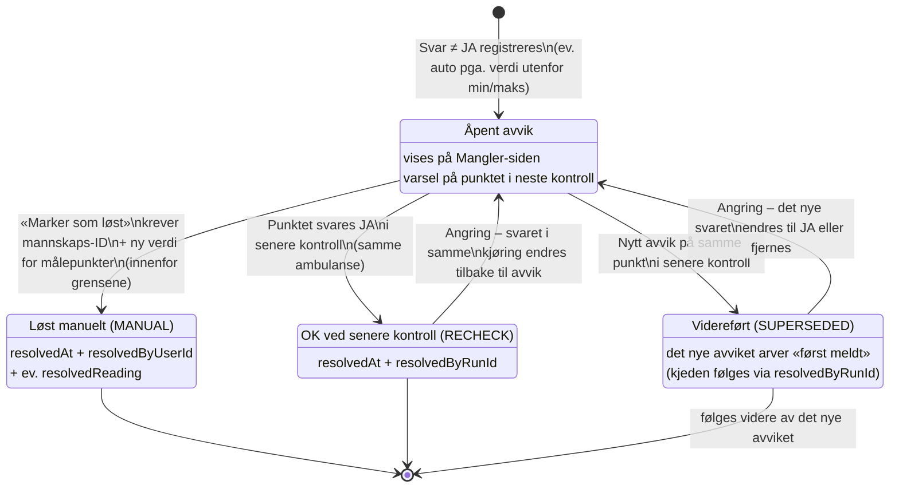

# Avvikets livssyklus

Et avvik er et svar (`ChecklistResponse`) med resultat NEI, MANGELFULL eller ØDELAGT.
Målepunkter utenfor grenseverdiene flagges automatisk som MANGELFULL.

## Notater

- **Kun åpne avvik** vises på Mangler-siden. Videreførte representeres av det nyeste
  avviket i kjeden, som viser «Videreført · først meldt {dato} av {navn}».
- **Arkivet** viser alle tilstander: åpne med resultat-badge, løste med grønn «Løst»
  (og hvordan/hvem/ny verdi), videreførte med oransje «Videreført».
- **Angring** er trygg: alle automatiske lukkinger husker hvilken kjøring som forårsaket
  dem (`resolvedByRunId`) og rulles tilbake hvis svaret endres i samme kjøring.
- **Historikk-telling**: «2 åpne avvik · 1 løst · 1 videreført» – videreført regnes
  aldri som løst.
