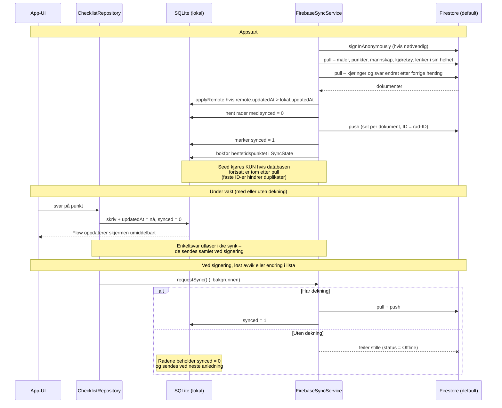

# Synkroniseringsflyt (lokal-først)

> **Rekkefølge: pull før push.** Push skriver hele dokumentet uten å
> sammenligne med det som allerede ligger i skyen. En enhet som har vært
> offline ville derfor kunne overskrive nyere endringer fra de andre bilene
> med sin egen utdaterte versjon. Ved å hente først blir lokale rader som er
> eldre enn skyen erstattet, og de er dermed ikke lenger usynkede når pushen
> kjører. Sikkerhetsreglene håndhever i tillegg at `updatedAt` aldri kan gå
> bakover – det fanger kappløpet der to enheter pusher samtidig.

## Notater

- **Appen venter aldri på nettet**: alle skriveoperasjoner går til SQLite og UI-et
  oppdateres via Flow. Synk er en bakgrunnsjobb ved appstart og når noe delbart
  endres.
- **Repositoryet utløser synken**, ikke skjermene. Utløseren lå tidligere som en
  callback tredd gjennom UI-treet, og to skjermer på Android fikk den aldri.
  Svar på enkeltpunkter er bevisst unntatt: mannskapet krysser av hundrevis av
  punkter i en kontroll, og de sendes samlet ved signering.
- **Kjøringer og svar hentes inkrementelt.** De er de eneste kolleksjonene som
  vokser monotont – én daglig kontroll er rundt 150 svar, altså over 50 000
  dokumenter i året per bil. Hentingen spør fra forrige hentetidspunkt minus et
  døgn. Overlappen er nødvendig fordi `updatedAt` settes fra klokka på enheten
  som skrev raden: uten den ville en rad skrevet av en enhet med litt etterslepende
  klokke aldri blitt hentet. Resten av kolleksjonene er små og hentes i sin helhet.
- **Konflikthåndtering**: nyeste `updatedAt` vinner per dokument (last-write-wins).
  Godt nok fordi to enheter sjelden redigerer samme rad, og kjøringer/svar er
  enhets-spesifikke frem til signering.
- **Slettinger** synkes som tombstones (`deleted = 1`), aldri som fysisk sletting –
  nødvendig for at en fremtidig intern Røde Kors-backend skal kunne overta.
- **Sikkerhet**: Firestore-reglene krever innlogget enhet, nekter endring av signerte
  kjøringer og all sletting.
