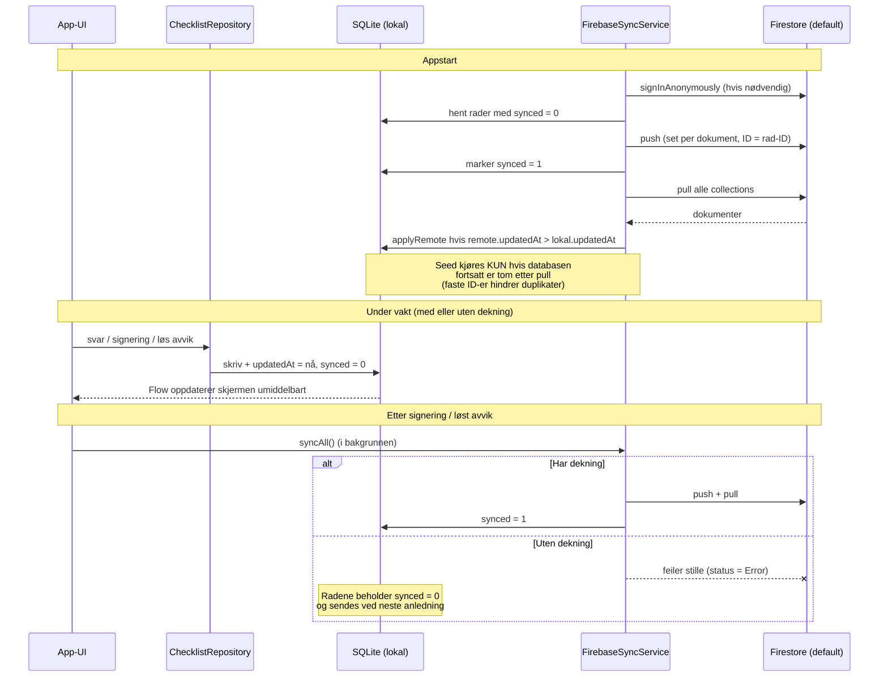

# Synkroniseringsflyt (lokal-først)

> **Rekkefølge: pull før push.** Push skriver hele dokumentet uten å
> sammenligne med det som allerede ligger i skyen. En enhet som har vært
> offline ville derfor kunne overskrive nyere endringer fra de andre bilene
> med sin egen utdaterte versjon. Ved å hente først blir lokale rader som er
> eldre enn skyen erstattet, og de er dermed ikke lenger usynkede når pushen
> kjører. Sikkerhetsreglene håndhever i tillegg at `updatedAt` aldri kan gå
> bakover – det fanger kappløpet der to enheter pusher samtidig.

## Notater

- **Appen venter aldri på nettet**: alle skriveoperasjoner går til SQLite og UI-et
  oppdateres via Flow. Sync er en bakgrunnsjobb ved appstart, etter signering og
  etter løst avvik.
- **Konflikthåndtering**: nyeste `updatedAt` vinner per dokument (last-write-wins).
  Godt nok fordi to enheter sjelden redigerer samme rad, og kjøringer/svar er
  enhets-spesifikke frem til signering.
- **Slettinger** synkes som tombstones (`deleted = 1`), aldri som fysisk sletting –
  nødvendig for at en fremtidig intern Røde Kors-backend skal kunne overta
  (SyncService-kontrakten).
- **Sikkerhet**: Firestore-reglene krever innlogget enhet, nekter endring av signerte
  kjøringer og all sletting.
