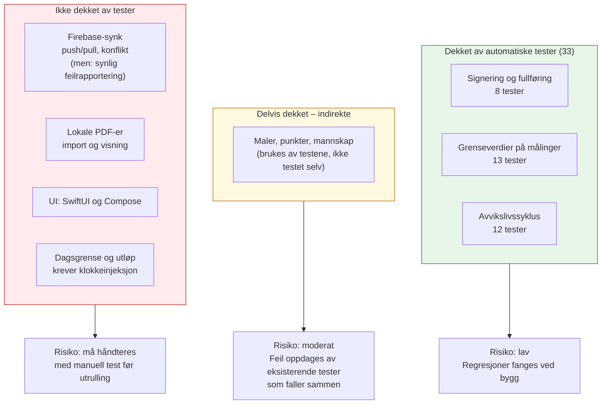

# Testdekning og risiko

Forvaltningsdokument. Viser hva som er verifisert med automatiske tester, hva som
ikke er det, og hvilken risiko som følger av hullene. Formålet er ikke å vise en
høy dekningsprosent, men å gjøre det tydelig hvor en feil faktisk får konsekvenser.

Sist oppdatert: 16. august 2026 · 33 automatiske tester, alle grønne.

## Oversikt

## Hva som er dekket

| Område | Tester | Hva som verifiseres | Konsekvens hvis det svikter |
|---|---|---|---|
| Signering og fullføring | `CompleteRunTest` (8) | Mannskaps-ID er påkrevd; alle punkter må være besvart, også de i sekker; slettede punkter blokkerer ikke; dobbeltsignering avvises; svar låses etter signering | En sjekkliste kunne blitt godkjent uten at alt utstyr faktisk er kontrollert |
| Grenseverdier på målinger | `MeasurementLimitsTest` (13) | Verdi utenfor min/maks flagges automatisk som mangelfull selv ved JA-svar; grensene er inklusive; ugyldige tall avvises; løsing krever ny verdi innenfor grensa; gammel verdi bevares | Et oksygenapparat med for lavt trykk kunne stått registrert som «i orden» |
| Avvikslivssyklus | `DeficiencyLifecycleTest` (12) | Automatisk lukking ved JA neste vakt (RECHECK); videreføring ved nytt avvik (SUPERSEDED) med sporing tilbake til første melding; angring ved endret svar i samme kontroll; avvik lekker ikke mellom ambulanser; manuell løsing overskrives ikke | Avvik kunne forsvunnet fra oversikten uten å være rettet, eller blitt dobbeltført |

Kjøres med `./gradlew :sharedLogic:testAndroidHostTest`. Hver test får sin egen
SQLite-database i minnet – ingen emulator, ingen nettverk, ingen Firebase.
Full kjøring tar under ett minutt.

## Hva som ikke er dekket

| Område | Hvorfor ikke | Risiko | Kompenserende tiltak |
|---|---|---|---|
| Firebase-synk (`FirebaseSyncService`) | Krever nettverk og et ekte Firestore-prosjekt | **Lav til moderat** (nedgradert 16.08.2026). Appen er lokal-først, så en synkfeil stopper ikke arbeidet i bilen. Feil er ikke lenger stille: de logges og vises for mannskapet | Synlig feilbanner i begge apper + `[Sync]`-logg. Testes fortsatt manuelt med to enheter før utrulling: meld avvik på enhet A, trykk synk på enhet B, se at det kommer fram |
| Firestore-sikkerhetsregler | Kan ikke enhetstestes fra appen; krever Firebase-emulator | **Moderat.** En regel som er for streng blokkerer synk stille (skjedde 16.08.2026, se under); en som er for åpen eksponerer mannskapsdata | Regelendringer må testes med både iOS og Android før utrulling, inkludert en *signert* kontroll – det var nettopp den tilstanden som avdekket feilen |
| Dagsgrense og utløp (`startOrResumeRun`) | `currentTimeMillis()`/`startOfTodayMillis()` kalles direkte og kan ikke styres fra en test | **Moderat.** En påbegynt liste kan i verste fall gjenbrukes over døgnskillet i stedet for å starte på nytt | Kan testes automatisk hvis klokka injiseres – anbefalt neste steg |
| Lokale PDF-er (`DocumentStorage`) | Plattformspesifikk filhåndtering (iOS og Android hver for seg) | **Lav.** Dokumentene er statiske; en feil merkes umiddelbart ved at PDF-en ikke åpner | Manuell sjekk ved import av nye instrukser |
| Brukergrensesnitt (SwiftUI og Compose) | Endres ofte; enhetstester her gir lav avkastning | **Lav til moderat.** Logikkfeil fanges av testene over, men feil i navigasjon eller knappetilstand fanges ikke | Én gjennomgang av hovedflyten på hver plattform før utrulling: start liste → svar nei → signer → se avviket i arkivet |
| Adaptiv layout (telefon/nettbrett) | Rent visuelt | **Lav.** | Visuell sjekk på iPhone, iPad, Android-telefon og Android-nettbrett |
| Seeding (`DatabaseSeeder`) | – | **Lav i dag.** Faste ID-er gjør gjentatt seeding trygg, men det er ikke verifisert automatisk | Bør legges til; enkel test (kjør to ganger, sjekk antall rader) |
| Hjelpefunksjoner for tall og URL | Ligger i `sharedUI` og er dermed Android-bundet | **Lav.** | Bør flyttes til `sharedLogic/util` så iOS og Android bruker samme regler og testes én gang |
| CRUD på maler, punkter, mannskap, kjøretøy, lenker | Brukes indirekte av alle testene over | **Lav.** En feil her ville fått testene over til å falle | – |

## Hendelse: stille synkstopp på iOS (16.08.2026)

Verdt å bevare fordi den viser hvordan hullene over henger sammen i praksis.

**Symptom:** endringer gjort på Android nådde aldri iPhone. Ingen feilmelding –
synk-knappen så ut til å fullføre normalt.

**Årsak:** sikkerhetsregelen for `runs` tillot oppdatering bare når dokumentets
*eksisterende* status var `IN_PROGRESS`. Så snart en kontroll var signert og
pushet som `COMPLETED`, ble alle senere skrivinger avvist. Siden
`pushLocalChanges()` kastet ved første avviste rad, og push kjørte før pull,
kom enheten aldri til pull-steget og fikk dermed aldri inn noe fra de andre.

**Hvorfor det tok tid å finne:** feilen var usynlig i tre ledd samtidig.
`syncAll()` fanget unntaket internt, ingen observerte `SyncStatus.Error`, og
kallerne brukte `try?`. Ingen logg fantes i synkroniseringskoden.

**Tiltak:**

- Regelen verner nå mot *hva* som endres (en signert kontroll kan ikke settes
  tilbake til påbegynt, og `updatedAt` kan ikke gå bakover) i stedet for å
  blokkere alle skrivinger til ferdige dokumenter
- Push er robust per rad: en avvist skriving teller opp og lar resten fortsette,
  raden beholder `synced = 0` og forsøkes igjen automatisk
- Pull kjører alltid, uavhengig av om push lyktes
- Delvis feil rapporteres som `SyncStatus.Error` med antall avviste rader
- Begge apper viser feilbanner; all synk logges med `[Sync]`-prefiks

**Lærdom for framtidige regelendringer:** en sikkerhetsregel som refererer
`resource.data` beskriver en tilstand som endrer seg over tid. Test alltid mot
et dokument som allerede har vært gjennom hele livsløpet, ikke bare et nytt.

## Anbefalt rekkefølge for videre arbeid

1. **Stram inn leserettighetene i Firestore.** `allow read` på `/{document=**}`
   gjør at enhver som kan logge inn anonymt – altså enhver med APK-en – kan lese
   alle mannskapsnavn og -ID-er. Bør gjøres før nettbrettene går ut i bilene.
2. **Klokkeinjeksjon** slik at dagsgrensen kan testes. Det største gjenværende
   hullet i selve forretningslogikken.
3. **Flytt hjelpefunksjonene** (`normalizeNumber`, `filterNumeric`, `normalizeUrl`) til
   `sharedLogic/util`. Gir felles regler på begge plattformer og testes én gang.
4. **Test av seeding** – to kjøringer skal ikke gi duplikater.
5. **Én gjennomgående UI-test per plattform** over hovedflyten. Fanger mer enn mange
   små UI-enhetstester.
6. **Vis sist synkronisert-tidspunkt** på dashbordet. Mest verdifullt for mannskapet:
   de ser selv om avviket har nådd de andre bilene, uten å måtte tolke en feilmelding.

## Vedlikehold av dette dokumentet

Oppdateres når det legges til tester eller ny funksjonalitet. Nye funksjoner som
påvirker pasientsikkerhet – validering, signering, avvikshåndtering – skal ha
tester før de tas i bruk. Rent visuelle endringer krever det ikke.

Se også: [`deviation-lifecycle.md`](deviation-lifecycle.md) for tilstandsmaskinen
testene verifiserer, og [`architecture.md`](architecture.md) for lagdelingen.
